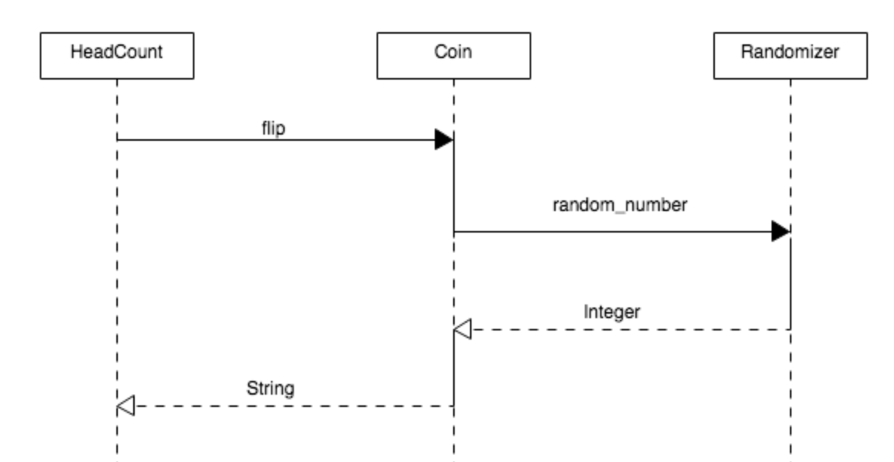
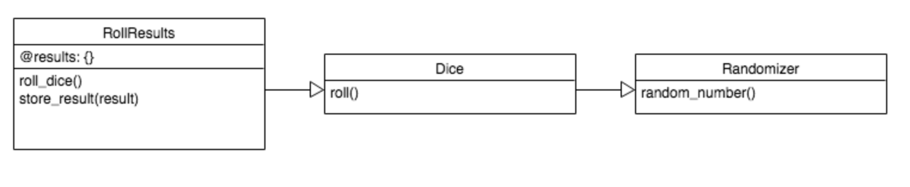

# Makers daily notes

- **Week 1** : [Day 1](#day-1---monday-11th-november-2019) | [Day 2](#day-2---tuesday-12th-november-2019) | [Day 3](#day-3---wednesday-13th-november-2019) | [Day 4](#day-4---thursday-14th-november-2019) | [Day 5](#day-5---friday-15th-november-2019) | [Days 6 & 7](#days-6-7---saturday-sunday-16th-17th-november-2019)

- **Week 2** : [Day 8](#day-8---monday-18-november-2019) | [Day 9](#day-9---tuesday-19-november-2019) | [Day 10](#day-10---wednesday-20-november-2019) | [Day 11](#day-11---thursday-21-november-2019) | [Day 12](#day-12---friday-22-november-2019) | [Days 13 & 14](#days-13-14---saturday-sunday-23th-24th-november-2019)

### Day 1 - Monday 11th November 2019

- Nice first day! Met my cohort-mates and had the opportunity to chat in small groups, getting to know each other. Also went for lunch with a few of them to Spitalfields Market and was fun.

- Really enjoyed how logically Alice elaborated our motivations to become software developers, while integrating our comments. It was very organic.

- Found very interesting the pyramid "concretes" -> "concept" -> "process" -> "behaviour", from bottom to top. The course will focus on the top 2, while touching on the bottom two, which are easier to be learnt on your own.

- Alice suggested to book more than 4 reviews throughout the entire course, since not everybody is going to need 4. The advice is to start from week 6, but, if confident, even after week 2.

- Will try to write down my learning progress following the "goal" -> "do / practice" -> "reflect" structure. The "reflect" part also includes "can I explain it to someone else?", which leads to validation.

- Enjoyed Dana's energy and I am looking forward to the yoga session tomorrow. My spirit animal is "eagle", to describe a sometimes solitary soul who likes movement.

### Day 2 - Tuesday 12th November 2019

- Week 1 goals:

  - TTD a simple program using objects and methods.

  - Pair using the driver-navigator style.

  - Follow an effective debugging process.

  - Describe some basic OO principles like encapsulation, SRP.

- Discussed about how to validate goals at the end of week 1:

  - Getting feedback from the pairing partner and coaches, screen recording and commit history.

  - Taking breaks, being mindful about whose time to drive, writing down an explaination or blog post about how to pair well.

  - Create a diagram of the process of debugging to describe the concepts to someone else.

- Really enjoyed the debugging workshop, and got the systematic approach for understanding what the problem is and how to fix it:

  - Tighten the loop: read carefully error messages, with the bug being in the line of code closest to the named error.

  - Get visibility: use `p` to inspect the code, but never put it at the end of a method as it might change its behaviour.

- Type of errors: SyntaxError and RuntimeError (NameError, ArgumentError etc.).

- Paired with Harry. The most challenging thing was being able to talk while getting my head around the current task.

- The challenge for the week was "Boris-bikes" and the learning objectives covered today were:

  - Transform an User Story (short, simple descriptions of a feature told from the perspective of the person who desires the new capability, usually a user or customer of the system) into a Domain Model (an abstraction, model of an area of interest, domain).

  - Define a Feature Test: the process of making changes in software system to add one or more new features or to make modifications in the already existing features.

  - Define a stack trace: a report of the active stack frames at a certain point in time during the execution of a program.

  - Use `irb` to run a Feature Test: `dock_station = DockStation.new` before creating the DockStation class.

  - Explain how to use a stack trace to debug errors, debug an error using a stack trace.

  - Define RSpec as a testing framework, create a spec file, describe an object using a specification.

  - Set up a Unit Test, pass a Unit test, move between Feature and Unit Test.

- Yoga was amazing. It was the first time in my life I have ever done a yoga session and I really loved it. Will be there on Thursday as well!

### Day 3 - Wednesday 13th November 2019

- Pairing with Jade was so much fun! At the end of the session we had a great chat and highlighted the following feedback points:

  - Well respected driver and navigator roles, letting the driver think and find the right solution, with the navigator supervising and googling questions.

  - Balanced interaction opposed to one sided.

  - Both of us had a chance to verbally explain a concept to the other person (the attr_accessor role to Jane and the Feature Test objective to me), and we both understood it well.

  - Relaxed and free to speak honestly since the beginning, making a lot of fun jokes.

  - Very motivated and assertive throughout the process with a good team spirit.

  - Celebrated failures and successes with a positive attitude.

  - Let the other person try out things without imposing ourselves.

  - Sometimes anticipating the thought or the pairing partner helping to smooth the process.

  - Not getting mad at each at the end, regardless the consistent error messages on the screen.

  - Probably we should have taken more breaks, but we both enjoyed the experience and were happy to continue coding.

### Day 4 - Thursday 14th November 2019

- The **TDD workshop** was great, with interaction between students & coach Alice and practical examples.

- What is TTD? A process of writing tests to guide the writing of code to meet the user needs.

- Why to use it? To help breaking down the problem, to serve as documentation, to act as a safety net (true for tests in general).

- A TDD process includes the following steps:

  - **Define user needs**: store money, discourage people from taking it out, destroy and take all the money out, shake it to find out if there is money (piggy bank project).

  - **Write user stories**:
    - As a user (entity that can do the things - this line is less useful until we have several roles in a program, like owner, guests etc.).
    - So I can save money (context - it doesn't describe the method and it is not integral part of the functionality of the program).
    - I want to store it in a piggy bank (most important line).

  - **Define a domain model** (nouns & verbs, objects & messages).

  - **Write a feature test**:
    `piggy_bank = piggyBank.new`
    `piggy_bank.store(1)`
    => `"clink"`

  - **Write a unit test**: to test something, ask yourself what is the behaviour of the thing you want to test - with an input / output table.
    - Input: 1 -> Output: "clink"
    - Input: 2 -> Output: "clink"
    - Input: 0 -> Output: nil

  - **Refactor the code if necessary**.

  - **Continue writing tests until the method is covered**.

- Testing state v behaviour: the test is written from the point of view of the user. You should never look inside, but instead use methods to check things inside the class. As soon as the user needs something, the store method will need to change, but not the tests.

- Additional notes: `Rspec -fd` shows a more detailed message.

- I paired with Zak and, since he was a bit behind me, I had the opportunity to explain things and consolidate my learning. Although a bit slow, the pairing was good as we both were listening to each other and respected the roles of the driver and navigator. In addition, writing down notes on paper helped us keep track or our progress and solve the challenges.

### Day 5 - Friday 15th November 2019

- I paired with Raluca and, although it was just for two hours, we had the opportunity to understand in more detail the concept of testing behaviour rather than state.

- At 4 we did the first retrospective and wrote on the white board positives and negatives of the first week. It was cool.

- Had drinks after 5 and met a few people from the other cohorts. Went to the pub and had a lot of fun getting to know my cohort-mates better and talk about more personal stuff.

### Days 6-7 - Saturday-Sunday 16th-17th November 2019

- [Airport challenge](https://github.com/AndreaDiotallevi/airport_challenge) over the weekend. I had fun solving the challenge and learned how to use doubles, stubs and mocks.

- From the pull request submission I received the following comments:

  - The README should include specific information on how to use and test the program.

  - The ```initilize``` method doesn't need to be tested as it usually leads to testing implementation instead of behaviour.

  - For the ```Plane``` and ```Weather``` classes I should have **stubbed randomness** and check when they should return ```true``` and when ```false```.

### Day 8 - Monday 18 November 2019

- I paired with David on the oystercard challenge and went really well. We both were solving problems very quickly and helped each other, forcing ourselves to follow the correct TDD process.

- Went to my first **process workshop** in the afternoon and funnily enough I got paired with Melvin, my mentor. We both did a 25 minutes session with 5 minutes feedback - me on the 'get middle letter' challenge and Melvin on the 'ten minutes walk' challenge. The feedback was very instructive as well as the following Q&A:

  - Instead of changing screen multiple times, better copy-paste useful information into the code base and split the screen with integrated terminal.

  - I could have worded my solution in a more complete way before jumping into coding the solution.

  - Read carefully about what is requested and how you are supposed to call the method from ```irb``` - ```"string".get_middle``` is different than ```get_middle("string")```.

  - Each test should help towards the correct solution. Therefore, apart from the first trivial test, we shouldn't hard-code the solution, but instead try to improve the code step by step. The order of the tests is important.

### Day 9 - Tuesday 19 November 2019

- Attended a 'feedback workshop' from Dana in the morning and it was very interesting.

- There are 3 types of feedback:

  - Appreciation.

  - Evaluation.

  - Coaching.

- Use the 'ASK' framework when giving feedback:

  - Actionable.

  - Specific.

  - Kind.

- I particularly enjoyed the last part of the workshop, when we had the chance to give our personal feedback to real work examples. I learned the following:

  - Start with "I have noticed..." rather than "You are...".

  - Request, not command.

  - Ask a question to check how the other responds and start from there, instead of going straight to the request.

- I paired with Kealan and it was a lot of fun. In the end he gave me the useful feedback of trying to involve the navigator a bit more with research, regardless if I thought I already knew the answer / syntax, in order to give the other person the opportunity to learn that particular thing as well.

- Received a great feedback from Alice on the video recording during my process workshop yesterday:

  - ANALYSING USER NEEDS:

    - You should spend a bit more time on the instructions and acceptance criteria:

    - You may want to build an input output table to explore the edge cases of the program, and to help you decide which case you should start with.

    - If you look more closely at the acceptance criteria, it's ```get_middle('test')``` not ```'test'.get_middle```.

  - TESTS:

    - You should start with a simpler test case (maybe one or two letters).

    - Each test description should be more specific (prefer ```it returns 'es' when passed 'test'``` to ```it returns the middle characters of a string```).

    - Also, I got very confused later because your test descriptions are reversed. When reading tests results, the test description is giving you context on which is the test that is failing. A wrong description makes it much more difficult to understand what is wrong.

    - Also you need more tests.

  - MODELLING / ALGORITHM DESIGN:

    - Between 8:20 and 9:25, I'm not sure what you were doing, but I guess you were developing the algorithm in your head.

    - Because of your test progression, you are jumping directly from hard coded result to creating the whole algorithm, when you should probably do one thing at a time (like maybe tackle odd number first).

    - Later you looked up "find middle char in string ruby". This is a little bit more specific than I would google. Since you have already found out about round, I would probably already be trying things either in ```irb``` or the code.

    - What I would expect you to google here is "how to get a char from a string by its index" or something along these lines.

  - CODING:

    - 14min - The code you write is complex enough that I would test it in ```irb``` as I go (or add puts and run the tests after every line). This is because debugging is harder when the whole thing has been written, as opposed to when you check that the result is what you expect at every stage.

    - 15:50 - When you fix the bug, there, I think you are missing the point of the error, which does not show the best debugging process.

    - The error was ```undefined method even?` for "test":String```. This should lead you to ask yourself what ```even?``` is defined on. Instead you choose to do things differently, which means you are not learning something new from the error.

    - Again here I would expect you to use ```irb``` a lot more to try things out.

    - 18min - your test descriptions tripped you up there.

  - OVERALL:
  
    - You need to improve your attention to detail, and I would really encourage you to run your code at every step of the process. This may mean going slightly slower, but in the end it would make you a lot faster.

### Day 10 - Wednesday 20 November 2019

- Attented a **workshop on domain models** in the morning with Sophie and it was very informative.

- There are two types of domain models:

  - **Sequence diagram**: the classes are displayed in rectangles at the top and the messages between the objects are shown with arrows. Continuous lines for messages, dotten lines for responses. Better not extend a message through two classes.

  

  - **Class diagram**: the instance variables and methods are listed in a table for each class.

  

- I paired with Sam and it was a great session, with lots of pace, balance and good exchange of different ideas. We learned how to extract a new class from an existing class making sure to keep the functionality. After the pairing he told me I helped him understand the difference between the driver and navigator roles and I was happy about that.

- Went to another process workshop, this time tackling the 'ten minute walk' challenge, with Alastair. I think I approached it more carefully than last time, paying attention to the user needs and starting from simple test cases. I guess the most difficult part this time was how to decide the best order for the test cases, and reach the final code in the most logical way.

### Day 11 - Thursday 21 November 2019

- Studied in the morning important principles of object-oriented programming, like forwarding and dependency injection.

- In object-oriented programming, **forwarding** means that using a member of an object (either a property or a method) results in actually using the corresponding member of a different object: the use is forwarded to another object. Forwarding is used in a number of design patterns, where some members are forwarded to another object, while others are handled by the directly used object. The forwarding object is frequently called a wrapper object, and explicit forwarding members are called wrapper functions.

  ```ruby
  class Diary
    def initialize
      @contents = "Eric Cantona is the best footballer"
    end

    def read
      @contents
    end
  end

  class SecretDiary
    def initialize
      @diary = Diary.new
      @unlocked = false
    end

    def unlock
      @unlocked = true
    end

    def lock
      @unlocked = false
    end

    def read
      return "Go away!" unless @unlocked
      @diary.read
    end
  end
  ```

  See how `SecretDiary` **forwards** methods on to `Diary`. The behaviours of 'locking/unlocking' and 'diary keeping' are now in separate classes. This is a better way of organising our code.

- In software engineering, **dependency injection** is a technique whereby one object supplies the dependencies of another object. A "dependency" is an object that can be used, for example as a service. Instead of a client specifying which service it will use, something tells the client what service to use. The "injection" refers to the passing of a dependency (a service) into the object (a client) that would use it. The service is made part of the client's state. Passing the service to the client, rather than allowing a client to build or find the service, is the fundamental requirement of the pattern.

  ```ruby
  class Greeter
    def initialize(smiley = Smiley.new)
      @smiley = smiley
    end

    def greet
      "Hello #{@smiley.get}"
    end
  end

  class Smiley
    def get
      ":)"
    end
  end
  ```

  Instead of hard coding the dependency, we 'inject' it into the class via the initializer. Dependency injection is a technique for helping you test classes in isolation. It allows a class to use either its real dependency, or a double.

- I paired with Danny and it was very interesting. I liked the fact that he cared about taking good breaks and spend quality time in front of the screen. We also had a nice conversation about how the mind works and the benefits of meditation, which made the session quite unique.

### Day 12 - Friday 22 November 2019

- Was supposed to pair with Hisham, but he was not well.

- It was the first time for me flying solo in the afternoon and I found myself being very concentrated and focused. I worked on the Oystercard challenge and consolidated my understanding of the class extracting process.

- In the morning I studied OOP principles such as:

  - **Law of demeter**: a design guideline for developing software, particularly object-oriented programs. In its general form, the LoD is a specific case of **loose coupling**. The guideline can be summarized in each of the following ways:

    - Each object should have only limited knowledge about other units.

    - Each object should only talk to its friends; don't talk to strangers.

    - Only talk to your immediate friends.

 - **Open closed principle**: tells us that we want our code to be open for extension but closed for modification. The ida is that if we need to add some new functionality then we can do that by extending our code rather than modifying it.

### Days 13-14 - Saturday-Sunday 23th-24th November 2019

- - [Takeway challenge](https://github.com/AndreaDiotallevi/takeaway-challenge/blob/master/MY_README.md) over the weekend. I had fun solving the challenge and learned how to use the Twilio API, how to test 3rd party dependencies and how to correctly use the dependency injection principle.
